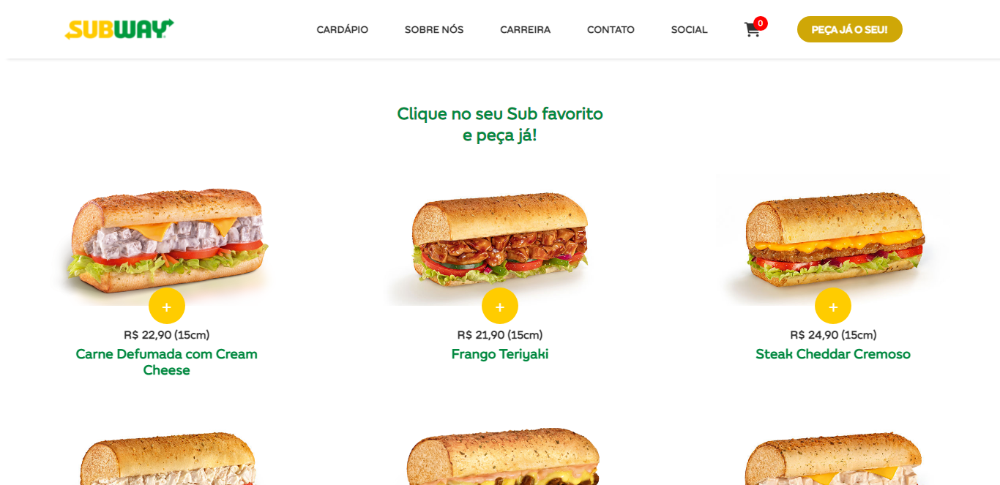

<p align="center">
      
</p>

<h2 align="center">About 📖</h2>
   
   <p align="center">
      This project is an ecommerce that makes life easier for the customer when ordering their Subway sandwich,<br> allowing them to order directly from the website,<br> without         need for food delivery apps.<br>
   </p>
   
<h2 align="center">Preview 🖥️</h2>

   <p align="center">
      
   </p>  
   
   >  * See the project in action [`here`](https://subway-redesign-project.netlify.app/). 🧐

---

<h2 align="center">Technologies 🚀</h2>

- [HTML](https://html.com/)
- [CSS](https://developer.mozilla.org/pt-BR/docs/Web/CSS)
- [JavaScript](https://www.javascript.com/)

---

<h2 align="center">How to use 🤔</h2>

```
- Clone this repo:
  $ git clone https://github.com/michaelsribeiro/subway-redesign-website.git

- Then go to the project's folder:
  $ cd subway-redesign-website

- Open your browser in:
  http://localhost:5500/ 
```

---

<h2 align="center">Licence 📝</h2>

<p align="center">
   This repo is under MIT Licence. You can see that <a href="https://github.com/michaelsribeiro/subway-redesign-website/blob/main/LICENSE.md"> LICENSE </a> for more details. 😉
</p>
